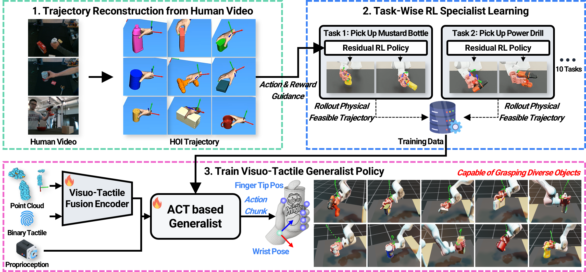

<div style="text-align: center; padding: 30px 0;">

<h1 style="font-size: 32px;"><span style="color: #2563eb;">UniDex-ViTac</span>: Learning Unified Visuo-Tactile Dexterous Manipulation Policy from Human Video Data</h1>

<!-- 저자 정보 (익명) -->
<div style="font-size: 18px; margin: 25px 0;">
<em>Anonymous Authors</em>
</div>

<!-- Workshop 정보 강조 -->
<div style="font-size: 17px; margin: 20px 0; color: #444;">
<strong>ICRA 2026 Workshop</strong><br>
<em>Beyond Teleoperation:<br>Learning from Diverse Human and Simulation Data</em>
</div>

<!-- 링크 버튼들 -->
<div style="margin: 30px 0;">
<a href="static/unidex_vitac.pdf" target="_blank" style="background: #333; color: white; padding: 10px 20px; margin: 5px; text-decoration: none; border-radius: 5px; display: inline-block;">📄 Paper (PDF)</a>
<a href="#" style="background: #aaa; color: white; padding: 10px 20px; margin: 5px; text-decoration: none; border-radius: 5px; display: inline-block;">💻 Code (coming soon)</a>
<a href="#video" style="background: #b85450; color: white; padding: 10px 20px; margin: 5px; text-decoration: none; border-radius: 5px; display: inline-block;">🎥 Video</a>
</div>

</div>

<!-- Teaser video -->
<div id="video" style="text-align: center; margin: 40px 0;">
<video autoplay muted loop playsinline style="width: 90%; max-width: 800px;">
    <source src="static/videos/teaser.mp4" type="video/mp4">
</video>
</div>

---

## Abstract

Learning dexterous robotic manipulation directly from human videos is fundamentally challenged by the kinematic embodiment gap and the lack of contact information that is unobservable in videos. To address these limitations, we present **UniDex-ViTac**, a unified visuo-tactile imitation learning framework that distills physically feasible, contact-rich trajectories generated by residual RL specialists into a single multi-task generalist policy. Crucially, our generalist operates on an expressive visuo-tactile representation that explicitly fuses global 3D point clouds with local binary tactile feedback. By effectively reasoning over both spatial geometry and local contact events, UniDex-ViTac achieves a **68.3%** success rate in simulation and demonstrates robust Sim2Real transfer on a physical 16-DoF hand, achieving a **66.4%** average success rate across diverse seen and unseen objects.

## Overview

<div style="text-align: center;">

</div>

Our method first trains **object-specific residual RL specialists** that adapt coarse HOI trajectories into physically feasible robot motions, bridging the embodiment gap. We then distill successful rollouts from these specialists into a **single multi-task generalist policy** that operates on a dual visuo-tactile representation, fusing global 3D point clouds with local binary tactile feedback.

## Results

### Simulation Results

<style>
.sim-tabs { margin: 30px 0; }
.sim-tab-list {
  list-style: none;
  padding: 0;
  margin: 0 0 20px 0;
  display: flex;
  flex-wrap: wrap;
  justify-content: center;
  gap: 8px;
}
.sim-tab-list li {
  padding: 8px 16px;
  border: 1px solid #ddd;
  border-radius: 6px;
  cursor: pointer;
  background: #f7f7f7;
  font-size: 14px;
  transition: background 0.15s, border-color 0.15s, color 0.15s;
  user-select: none;
}
.sim-tab-list li:hover { background: #eaeaea; }
.sim-tab-list li.is-active {
  background: #2563eb;
  color: white;
  border-color: #2563eb;
}
.sim-video-panel { display: none; }
.sim-video-panel.is-active { display: block; }
.sim-video-grid {
  display: grid;
  grid-template-columns: 1fr 1fr;
  gap: 12px;
  max-width: 900px;
  margin: 0 auto;
}
.sim-video-grid video { width: 100%; border-radius: 6px; }
</style>

<div class="sim-tabs" id="sim-video-tabs">

<ul class="sim-tab-list">
<li class="is-active" data-target="sim-bleach_cleanser">Bleach Cleanser</li>
<li data-target="sim-master_chef_can">Master Chef Can</li>
<li data-target="sim-mug">Mug</li>
<li data-target="sim-mustard_bottle">Mustard Bottle</li>
<li data-target="sim-potted_meat_can">Potted Meat Can</li>
<li data-target="sim-power_drill">Power Drill</li>
<li data-target="sim-pudding_box">Pudding Box</li>
<li data-target="sim-sugar_box">Sugar Box</li>
<li data-target="sim-tomato_soup_can">Tomato Soup Can</li>
<li data-target="sim-wood_block">Wood Block</li>
</ul>

<div class="sim-video-panel is-active" id="sim-bleach_cleanser">
<div class="sim-video-grid">
<video autoplay muted loop playsinline><source src="static/video/bleach%20cleanser/bleach_cleanser_1.mp4" type="video/mp4"></video>
<video autoplay muted loop playsinline><source src="static/video/bleach%20cleanser/bleach_cleanser_2.mp4" type="video/mp4"></video>
</div>
</div>

<div class="sim-video-panel" id="sim-master_chef_can">
<div class="sim-video-grid">
<video muted loop playsinline><source src="static/video/master%20chef%20can/master_chef_can_1.mp4" type="video/mp4"></video>
<video muted loop playsinline><source src="static/video/master%20chef%20can/master_chef_can_2.mp4" type="video/mp4"></video>
</div>
</div>

<div class="sim-video-panel" id="sim-mug">
<div class="sim-video-grid">
<video muted loop playsinline><source src="static/video/mug/mug_1.mp4" type="video/mp4"></video>
<video muted loop playsinline><source src="static/video/mug/mug_2.mp4" type="video/mp4"></video>
</div>
</div>

<div class="sim-video-panel" id="sim-mustard_bottle">
<div class="sim-video-grid">
<video muted loop playsinline><source src="static/video/mustard%20bottle/mustard_bottle_1.mp4" type="video/mp4"></video>
<video muted loop playsinline><source src="static/video/mustard%20bottle/mustard_bottle_2.mp4" type="video/mp4"></video>
</div>
</div>

<div class="sim-video-panel" id="sim-potted_meat_can">
<div class="sim-video-grid">
<video muted loop playsinline><source src="static/video/potted%20meat%20can/potted_meat_can_1.mp4" type="video/mp4"></video>
<video muted loop playsinline><source src="static/video/potted%20meat%20can/potted_meat_can_2.mp4" type="video/mp4"></video>
</div>
</div>

<div class="sim-video-panel" id="sim-power_drill">
<div class="sim-video-grid">
<video muted loop playsinline><source src="static/video/power%20drill/power_drill_1.mp4" type="video/mp4"></video>
<video muted loop playsinline><source src="static/video/power%20drill/power_drill_2.mp4" type="video/mp4"></video>
</div>
</div>

<div class="sim-video-panel" id="sim-pudding_box">
<div class="sim-video-grid">
<video muted loop playsinline><source src="static/video/pudding%20box/pudding_box_1.mp4" type="video/mp4"></video>
<video muted loop playsinline><source src="static/video/pudding%20box/pudding_box_2.mp4" type="video/mp4"></video>
</div>
</div>

<div class="sim-video-panel" id="sim-sugar_box">
<div class="sim-video-grid">
<video muted loop playsinline><source src="static/video/sugar%20box/sugar_box_1.mp4" type="video/mp4"></video>
<video muted loop playsinline><source src="static/video/sugar%20box/sugar_box_2.mp4" type="video/mp4"></video>
</div>
</div>

<div class="sim-video-panel" id="sim-tomato_soup_can">
<div class="sim-video-grid">
<video muted loop playsinline><source src="static/video/tomato%20soup%20can/tomato_soup_can_1.mp4" type="video/mp4"></video>
<video muted loop playsinline><source src="static/video/tomato%20soup%20can/tomato_soup_can_2.mp4" type="video/mp4"></video>
</div>
</div>

<div class="sim-video-panel" id="sim-wood_block">
<div class="sim-video-grid">
<video muted loop playsinline><source src="static/video/wood%20block/wood_block_1.mp4" type="video/mp4"></video>
<video muted loop playsinline><source src="static/video/wood%20block/wood_block_2.mp4" type="video/mp4"></video>
</div>
</div>

</div>

<script>
(function() {
  var root = document.getElementById('sim-video-tabs');
  if (!root) return;
  var tabs = root.querySelectorAll('.sim-tab-list li');
  var panels = root.querySelectorAll('.sim-video-panel');
  tabs.forEach(function(tab) {
    tab.addEventListener('click', function() {
      tabs.forEach(function(t) { t.classList.remove('is-active'); });
      tab.classList.add('is-active');
      var targetId = tab.getAttribute('data-target');
      panels.forEach(function(p) {
        if (p.id === targetId) {
          p.classList.add('is-active');
          p.querySelectorAll('video').forEach(function(v) { v.play().catch(function(){}); });
        } else {
          p.classList.remove('is-active');
          p.querySelectorAll('video').forEach(function(v) { v.pause(); });
        }
      });
    });
  });
})();
</script>

### Real-World Results

<div style="text-align: center;">
<video controls style="width: 90%; max-width: 800px;">
    <source src="static/videos/realworld.mp4" type="video/mp4">
</video>
<p><em>Deployed on a Franka Emika Panda with a 16-DoF dexterous hand.</em></p>
</div>

## Paper

<div style="text-align: center; margin: 30px 0;">
<a href="static/unidex_vitac.pdf" target="_blank">
    
</a>
<p><em>Click to download the full paper (PDF)</em></p>
</div>

## Citation

```bibtex